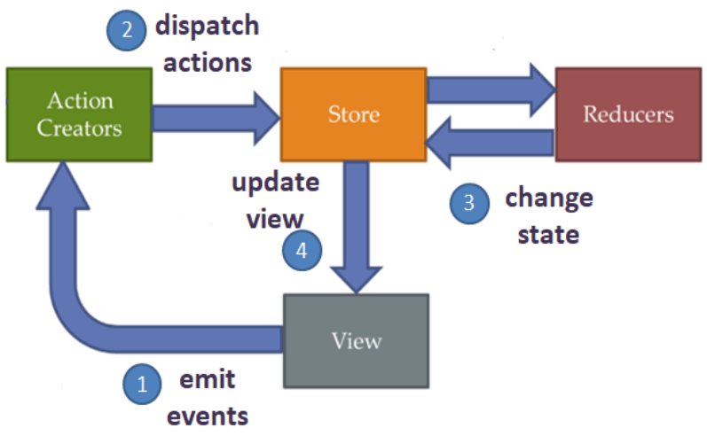

# simple JavaScript reactive component state manager with no outer dependencies

## 6 steps example

1. [Setup, component, state](https://github.com/AtanasRaykovPapucharov/simpleReactiveComponentStateManager/tree/master/1-setup-component-state)
2. [Events](https://github.com/AtanasRaykovPapucharov/simpleReactiveComponentStateManager/tree/master/2-events)
3. [Store and action](https://github.com/AtanasRaykovPapucharov/simpleReactiveComponentStateManager/tree/master/3-store-and-action)
4. [Reducer and State manager](https://github.com/AtanasRaykovPapucharov/simpleReactiveComponentStateManager/tree/master/4-reducer-and-state-manager)
5. [Publish / subscribe](https://github.com/AtanasRaykovPapucharov/simpleReactiveComponentStateManager/tree/master/5-publish-subscribe)
6. [Observer and observable](https://github.com/AtanasRaykovPapucharov/simpleReactiveComponentStateManager/tree/master/6-observer-and-observable)

## The purpose of this simple example is to implement state manager pattern in a reactive variant

